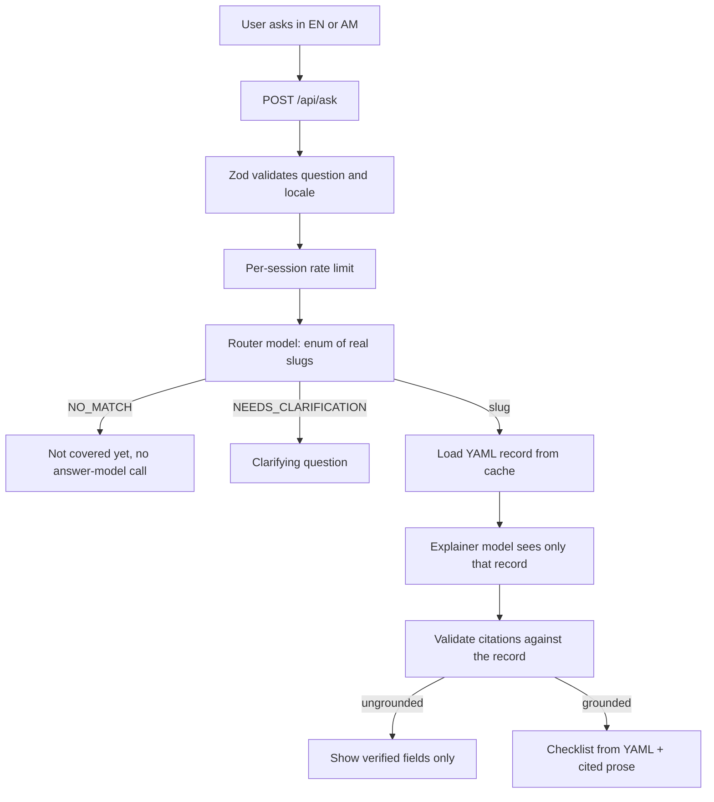

# GovGuide-AI

A bilingual (English / አማርኛ) guide to Ethiopian government services. Ask a question in
either language and get the documents to bring, the steps to follow, the fees, and where
to go — as an interactive checklist rather than a wall of text.

The distinguishing property of this application is that **the language model is never
allowed to state a fact.** Every document, fee, office, and processing time a user sees
comes from a version-controlled, schema-validated knowledge base. The model only decides
*which* record answers the question and writes the connective prose around it.

## Why that matters

An AI that invents a document requirement does real harm: someone travels across a city,
queues for hours, and is turned away. Plausible-sounding wrong answers are worse than no
answer. So the architecture treats fabrication as a threat to design against, not a
behaviour to discourage in a prompt.

## How hallucination is prevented

Four structural constraints, none of which depend on the model cooperating:

1. **Routing is a closed set.** The router model's structured output is typed as
   `z.enum([...slugs])` built from the YAML catalog at runtime. It is not possible for
   the model to name a service that does not exist — the schema rejects the response
   before the application sees it.
2. **Facts are never generated.** Documents, fees, offices, and steps are rendered
   straight from the YAML record by React components. The model's prose is displayed
   *beside* those facts, never in place of them.
3. **Citations are verified server-side.** The explainer must cite field paths
   (`documents.0`, `steps.2`). Every citation is checked against the retrieved record. A
   citation that does not resolve, or prose citing nothing at all, is discarded and the
   user is shown the verified record alone.
4. **No match means no second model call.** An unmatched question returns "not covered
   yet" without ever invoking the answer model.

An unverified record additionally suppresses fees and offices *on the server*, in
`toServiceView`, so unverified figures are never serialized to the browser at all. The
same rule gates `listCitations`, so those fields are also withheld from the explainer —
otherwise the UI could hide the fee table while the model quoted the figure in prose.
Both call `canDiscloseFeesAndOffices`, so the two halves cannot drift apart.

## Request flow



Both model calls are cached in Postgres. The cache key includes the question, locale, and
model id, plus a hash of the catalog for routing and a hash of the record for
explanations — so editing a YAML file invalidates the entries that depended on it without
anyone having to remember to flush a cache.

## Coverage

Nine records across five services, plus a template. Every one ships
`verified: false` — see [Limitations](#limitations).

| Service | Records |
| --- | --- |
| Passport | `new-passport`, `passport-renewal`, `lost-or-damaged-passport` |
| Business registration | `business-registration-sole-proprietor`, `business-registration-private-company` |
| National ID (Fayda) | `fayda-lost-number`, `fayda-update-details` |
| Individual TIN | `individual-tin-registration` |
| Income tax | `income-tax-payment` |

Variants are separate records rather than branches inside one record, because
the router picks a slug and a citizen who lost their Fayda *number* needs
different guidance from one whose registered name is wrong. Collapsing them
would force the model to choose between them in prose, which is exactly the
judgement it is not trusted to make.

## Stack

| Concern | Choice |
| --- | --- |
| Framework | Next.js 16 (App Router), React 19, TypeScript strict |
| Styling | Tailwind CSS 4, shadcn/ui, lucide-react |
| AI | Vercel AI SDK 7 via OpenRouter, structured outputs only |
| Validation | Zod 4 — knowledge base, source registry, API input, environment, model output |
| Database | PostgreSQL via Drizzle ORM |
| i18n | next-intl, `/en` and `/am` route prefixes |
| Knowledge tooling | `pdf-parse` for PDFs, hand-rolled HTML extraction and BM25 retrieval |
| Rate limiting | In-memory fixed window, per session |
| Tests | Vitest |
| Deployment | Render — one web service, one managed Postgres |

The knowledge tooling is build-time only. Nothing in `lib/retrieval/` is
imported by the application; it exists so that an author drafting a record reads
official text rather than recalling it.

## Layout

```
app/[locale]/          pages: ask, services catalog, service detail
app/api/ask/           the one route handler
knowledge/services/    *.yaml — the source of truth for every fact
knowledge/sources.json the registry of official sources records may cite
lib/knowledge/         Zod schema, cached loader, citations, view flattening, source registry
lib/retrieval/         build-time only: HTML/PDF extraction, chunking, BM25
lib/ai/                provider, prompts, output schemas
services/              orchestration (guidance.service.ts)
repositories/          data access, all scoped by session_id
db/                    Drizzle schema and migrations
actions/               server actions for the checklist
messages/              en.json, am.json
scripts/               validate-knowledge (prebuild), ingest, draft, verify-citations
test/                  unit and integration suites
```

## Getting started

Requires Node 22+.

```bash
npm install
cp .env.example .env.local   # then add your OpenRouter key
npm run dev
```

Open http://localhost:3000 — you will be redirected to `/en`.

A database is **optional**. Without `DATABASE_URL` the app answers questions normally; it
just cannot remember sessions, saved checklists, or cache model calls. To run one:

```bash
docker run -d --name govguide-pg -e POSTGRES_PASSWORD=devpass \
  -e POSTGRES_USER=govguide -e POSTGRES_DB=govguide -p 5432:5432 postgres:17-alpine
npm run db:migrate
```

### Commands

| Command | Purpose |
| --- | --- |
| `npm run dev` | Development server |
| `npm run build` | Production build (validates the knowledge base first) |
| `npm run typecheck` | `tsc --noEmit` |
| `npm run lint` | ESLint |
| `npm test` | Vitest; integration tests skip themselves without a database |
| `npm run knowledge:validate` | Validate every YAML record against the schema |
| `npm run ingest` | Fetch and chunk the registered sources into a local index |
| `npm run draft` | Emit evidence bundles from that index |
| `npm run verify:citations` | Check every cited URL is registered and reachable |
| `npm run db:generate` / `db:migrate` / `db:studio` | Drizzle Kit |

## The knowledge pipeline

A record is written by a person reading official text, not by a model
summarising it. The pipeline exists to put the right official text in front of
that person and to keep them honest about where each fact came from.

```
knowledge/sources.json  →  npm run ingest  →  npm run draft  →  a human writes the YAML
   registered sources      fetch, extract,     BM25 evidence      curated record
                           chunk, cache          bundles                ↓
                                                              npm run verify:citations
```

**`knowledge/sources.json`** is the registry of documents a record may cite,
Zod-validated like everything else. Each entry declares a lane: `official` means
a government publisher describing its own procedure, `community` is everything
else. A record may only cite the official lane, and `verify:citations` fails the
build if one ever cites the other. The community lane exists so that reports of
what an office is asking for *today* can be collected later without ever being
mistaken for the verified roadmap.

**`npm run ingest`** fetches each source, extracts text — `pdf-parse` for PDFs,
a small hand-rolled stripper for HTML — discards lines that recur across the
corpus (otherwise every query retrieves the site navigation), chunks on line
boundaries with overlap, and writes `knowledge/.index/`. Both the index and the
raw text are gitignored: they are reproducible from the registry.

**`npm run draft`** ranks chunks with BM25 and writes an evidence bundle per
topic. A bundle is quoted passages with their sources and a `TODO_VERIFY`
checklist — deliberately *not* a draft YAML record, because generating one would
invite someone to accept it wholesale.

Lexical retrieval is the right tool here precisely because it is dumb: it can
only surface text that exists in the corpus, and a passage that ranks badly is a
visible signal that the sources do not cover the topic.

**`npm run verify:citations`** audits the result. An unregistered or
community-lane citation is an error, because that is a fact about this
repository. An unreachable URL is only a warning, because that is a fact about
the public internet and these hosts go down constantly; `--strict` promotes it.

### Adding a service

1. Register any new official source in `knowledge/sources.json`.
2. `npm run ingest` then `npm run draft -- "your topic"`.
3. Read the bundle, open the source URLs, and write the YAML by hand using
   `example-service-template.yaml` as the shape. If a fee or deadline is not
   written down in a source, leave it out rather than inferring it.
4. `npm run verify:citations`.

Every user-facing string needs both `en` and `am`. The schema is strict: unknown
keys, non-HTTPS source URLs, impossible dates, and verified records without
sources all fail the build, because `prebuild` runs the validator. A new slug
enters the router's enum automatically.

Set `verified: false` until a human has checked the record against the official
source. Unverified records render a warning banner and have their fees and
offices withheld from the browser and from the model alike.

## Deployment

`render.yaml` describes one web service plus one managed Postgres. Push the repository,
create a Blueprint on Render, then set the secrets marked `sync: false` in the dashboard:
`OPENROUTER_API_KEY`, the three model ids, and `APP_URL`. `DATABASE_URL` is wired
automatically. Migrations are applied with `npm run db:migrate`.

## Limitations

Stated plainly, because pretending otherwise would undercut the point of the project:

- **Every record ships unverified.** Nine records compiled from official sources, none
  checked by a person against its citations, so all of them render the warning banner and
  withhold fees and offices. The architecture is complete; the content is provisional.
- **The official sources contradict each other.** ICS states the passport payment window
  as both 3 hours and 1 hour, and gives two different application portals, on pages
  published months apart. The records document the disagreement rather than silently
  picking one, but a reviewer has to resolve it with ICS directly.
- **No document list exists for a damaged passport.** ICS publishes the fee but not the
  requirements, so that half of the replacement record is an acknowledged gap.
- **The Ministry of Revenue publishes nothing a machine can read.** `mor.gov.et` and the
  eTax portal are client-rendered applications, so the TIN and income tax records are
  built from a Ministry of Finance PDF instead of from the authority that actually issues
  a TIN. That PDF is addressed to foreign investors and states that ePayment is not
  operational — yet the eTax portal is live today, so it is demonstrably out of date. Both
  tax records say so in `verification.note`. `mor.gov.et` also serves a valid certificate
  without its intermediate, so ingest needs a per-source TLS exception to read it at all.
- **Proclamation 1150/2019 is a scan with no text layer.** It amends 980/2016, and the
  pipeline extracted 44 characters from it. Anything quoted from 980 could already be
  repealed by an amendment nobody can machine-read, which is why the business records cite
  it only for the TIN mechanism.
- **Splitting business registration by legal form is our editorial judgement.** MoTRI
  publishes one requirement list covering individual traders and business organisations
  together. The sole-proprietor and private-company records divide it by applicability;
  MoTRI does not.
- **Law is not procedure.** A proclamation states what must be true, not which portal to
  use or what the office asks for this month. Federal rules also differ from regional
  revenue bureaux, so guidance grounded in federal sources can be right in Addis and wrong
  elsewhere.
- **The Amharic UI strings need a native-speaker review.** Government terminology in
  particular is easy to get subtly wrong, and I would not launch on my translations.
- **The default model ids are a starting point, not a recommendation.** They were
  confirmed against OpenRouter's live model list and filtered to those supporting
  structured outputs, but their Amharic quality has not been evaluated.
- **Rate limiting is in-memory**, so it is per-instance and resets on deploy. Fine for one
  instance; a shared store is needed before scaling out.
- **The explanation is not streamed.** Streaming would mean showing prose before its
  citations could be validated, which would break the central guarantee. Correctness won
  over perceived latency.
- **Routing quality is untested at scale.** A question that maps to no slug returns "not
  covered", which is honest but unhelpful when the service actually exists under wording
  the router did not recognise.
- **No accounts, so no cross-device continuity.** Clearing cookies loses saved checklists.

## Possible next steps

- Verify the nine existing records against their sources and flip `verified` to true,
  which is what unlocks fees and offices in the UI. This is the highest-value work left.
- Extend coverage to the next highest-traffic services: driving licence, birth
  certificate, and the regional revenue bureaux that most citizens actually deal with.
- Per-field citations. Records currently cite sources at the record level; pinning a
  specific document or fee to a specific article would let the UI show a source chip
  beside each fact rather than one banner for the whole page.
- Embedding-based retrieval alongside the enum router, to catch phrasings the classifier
  misses while keeping the closed-set guarantee.
- An admin review workflow for flipping `verified` to true, with the reviewer and date
  recorded in the record.
- Feedback-driven gap analysis: the `feedback` and `messages` tables already capture what
  people ask and whether it helped, which is exactly the signal needed to decide what to
  document next.
- Offline support, since connectivity is unreliable in much of the country and a
  checklist is useful precisely when standing in a queue.
- Redis-backed rate limiting and caching for multi-instance deployment.
